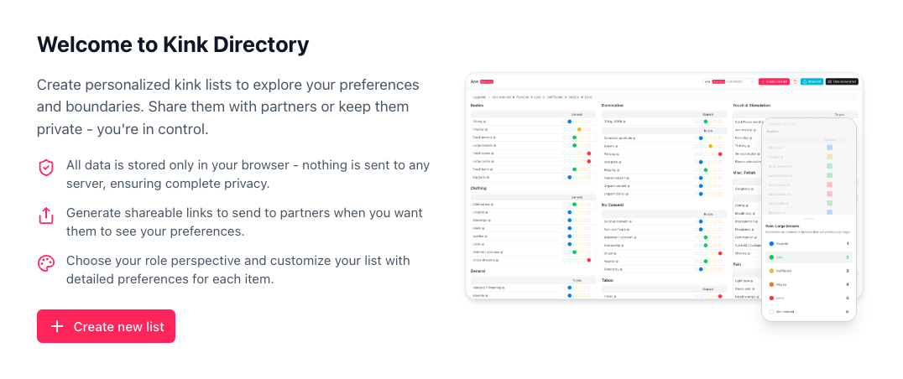
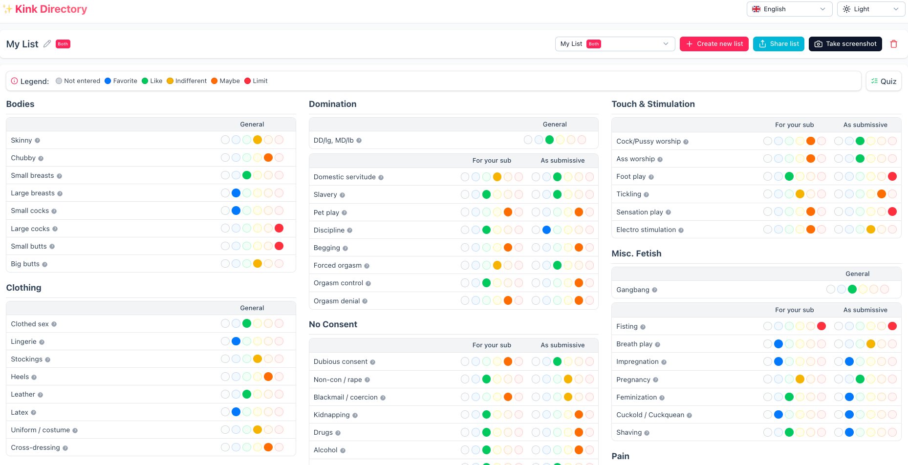
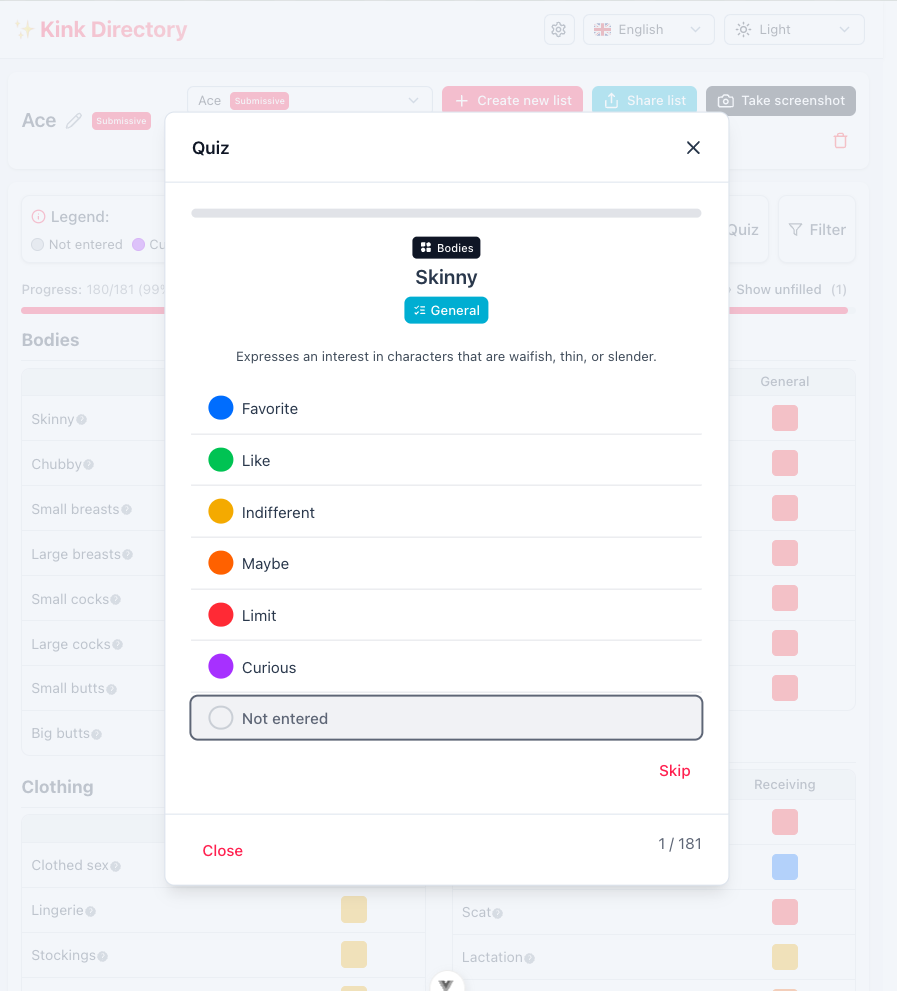
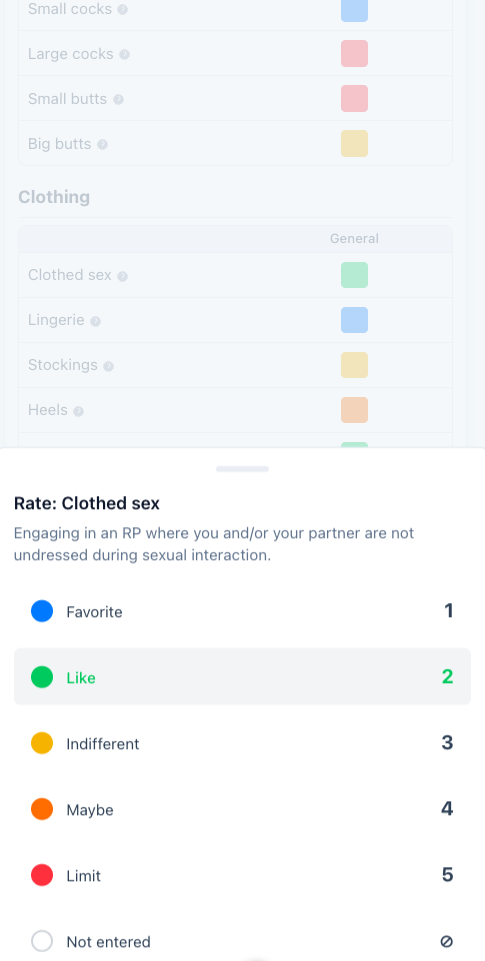

# 📋 Kink Directory

A privacy-focused tool to explore, define, and share your preferences and boundaries.

## ✨ About

Kink Directory is a comprehensive BDSM-focused tool that helps you create personalized kink lists to explore your preferences and boundaries. Whether you're new to kink or experienced, this application makes it easy to communicate your interests with partners or keep track of your own journey.

The directory is designed with BDSM dynamics in mind, allowing you to specify your role as Dominant, submissive, or Switch. This role selection helps tailor your experience and ensures your kink list accurately reflects your position in power exchange dynamics.

## 🚀 Features

- ✏️ **Create personalized lists** - Explore your preferences and boundaries at your own pace
- 🔒 **Complete privacy** - All data is stored only in your browser, nothing is sent to any server
- 🔗 **Share with partners** - Generate shareable links to send to partners when you want them to see your preferences
- 👤 **Role customization** - Choose your role perspective and customize your list with detailed preferences for each item
- 🎨 **User-friendly interface** - Simple, clean design with intuitive controls
- 🌐 **Multi-language support** - Available in multiple languages to serve a global audience
- 📝 **Quiz mode** - Quickly rate all kinks by going through them one by one in a guided interface
- 🔍 **Advanced filtering** - Filter by new items, unfilled items, or specific choice ratings for easy exploration

## 🌍 Supported Languages

- English
- Nederlands (Dutch)
- Español (Spanish)
- Français (French)
- Deutsch (German)
- Italiano (Italian)
- Português (Portuguese)
- Русский (Russian)
- 中文 (Chinese)
- 日本語 (Japanese)
- 한국어 (Korean)
- العربية (Arabic)
- हिन्दी (Hindi)

## 🛡️ Privacy First

Your privacy is our top priority:

- 💻 **100% browser-based** - All data stays on your device
- 🙅 **No accounts needed** - No sign-up, no personal information collected
- 🚫 **No tracking** - No analytics or cookies that follow you around
- 📖 **Open source** - Code is transparent and available for review

## 🔄 How It Works

1. ✨ Create a new list
2. ✅ Customize your preferences for each item
3. 💾 Save your list (stored locally in your browser)
4. 📤 Optionally generate a shareable link for partners
5. 🔄 Update or modify your list anytime

## 🏁 Getting Started

Simply click "Create new list" to begin exploring your preferences! 🎉

## 📌 Filtering Options

The Kink Directory offers powerful filtering tools to help you navigate your preferences:

- 🆕 **New Items Filter** - Focus on recently added kinks to keep your list up-to-date
- ❓ **Unfilled Items Filter** - Quickly identify kinks you haven't rated yet
- 🌈 **Choice Filters** - Filter by specific ratings (Favorite, Like, Indifferent, Maybe, Limit) to review similar preferences together
- 🔄 **Combined Filters** - Use multiple filters together for more precise navigation

These filtering options make it easy to manage large lists and focus on specific aspects of your preferences.

## 🔮 Upcoming Features

We're constantly working to improve Kink Directory. Here are some features we're planning to implement:

- 🔍 **More kinks** - Expanding our list of kinks and preferences for a more comprehensive experience
- 🔄 **Compare lists** - Ability to compare your preferences with a partner to quickly identify common interests and boundaries
- 🏷️ **Category filtering** - Toggle kinks based on categories (e.g., IRL practicality, intensity levels, or activity types)

## 📱 Screenshots

### Create a New List

### Customizing Your List

### Quiz Mode

### Mobile Experience

